# Crispframe screenshot gallery

Real browser captures from the [development demo](https://dev-crispframe.ppxl.dev/), taken **29 September 2026**. Desktop previews use 1440 px width; mobile previews use 390 px. The contact form and pricing captures use taller viewports.

The demo can contain changes ahead of the latest Composer release. All names, prices, photos, and editorial content shown here are replaceable examples from the optional demo package.

[Installation](../README.md#installation) · [First-run checklist](FirstRun.md) · [Page recipes](PageRecipes.md)

## Homepage

## Menus and mobile

| Mobile homepage | Expanded mobile menu |
| --- | --- |
| 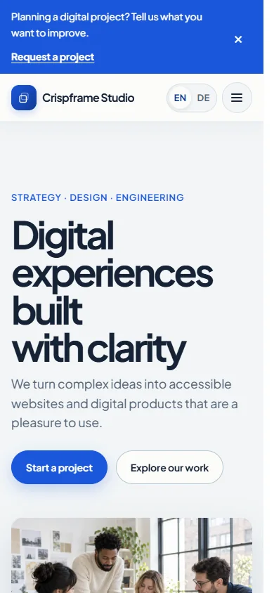 | 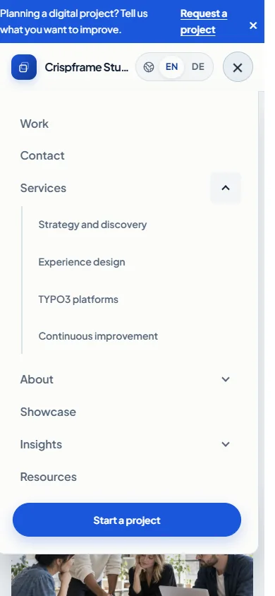 |

## Reusable components

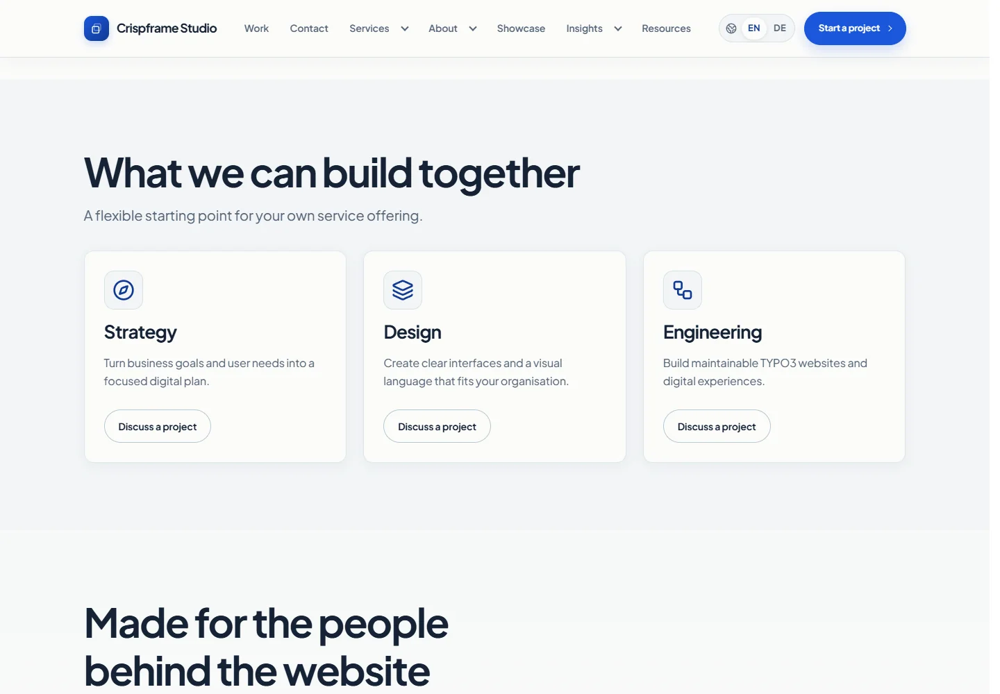

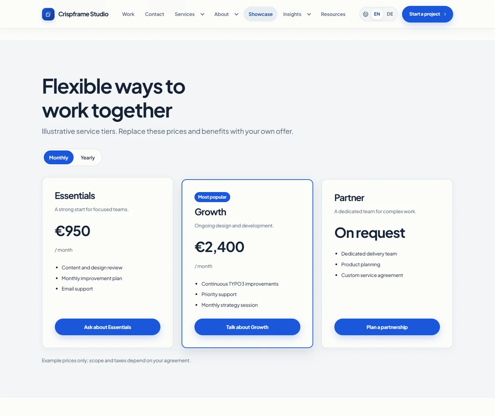

## Guided style variants

The [editable showcase](https://dev-crispframe.ppxl.dev/components/style-variants) compares all six block controls. See the [choice guide](StyleVariants.md) for short use cases.

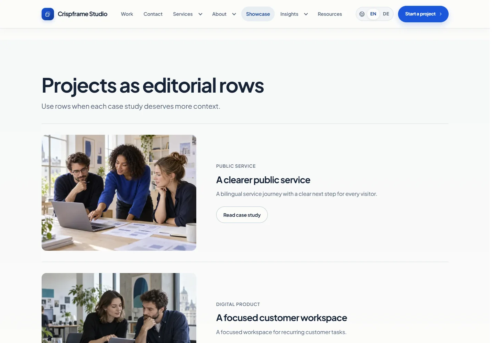

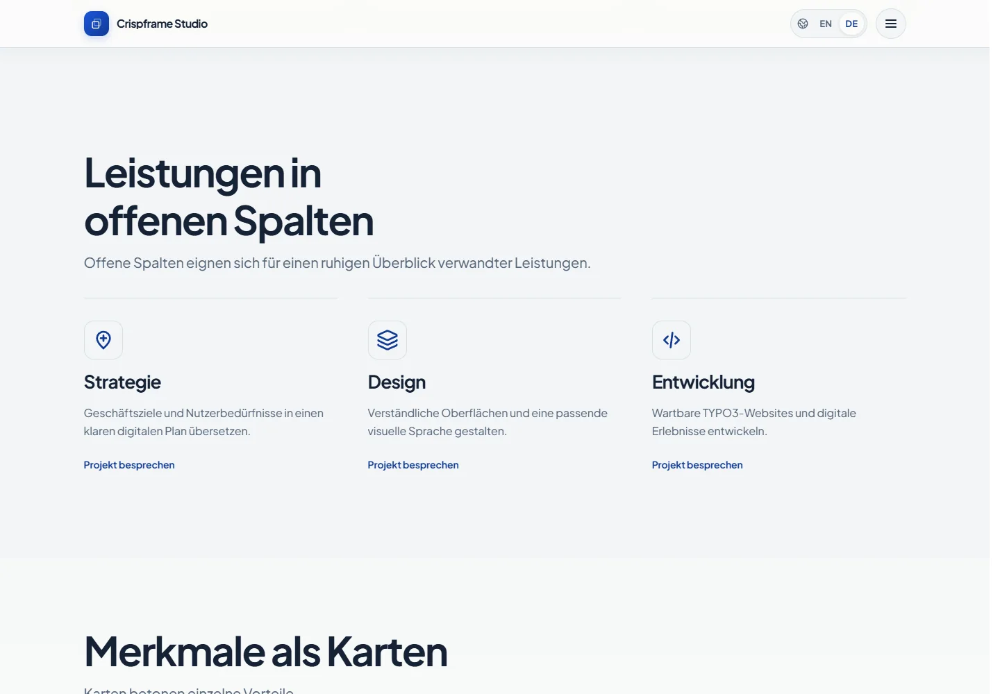

## Contact and inquiries

[Visit Contact](https://dev-crispframe.ppxl.dev/contact) · [Visit Project inquiry](https://dev-crispframe.ppxl.dev/project-inquiry)

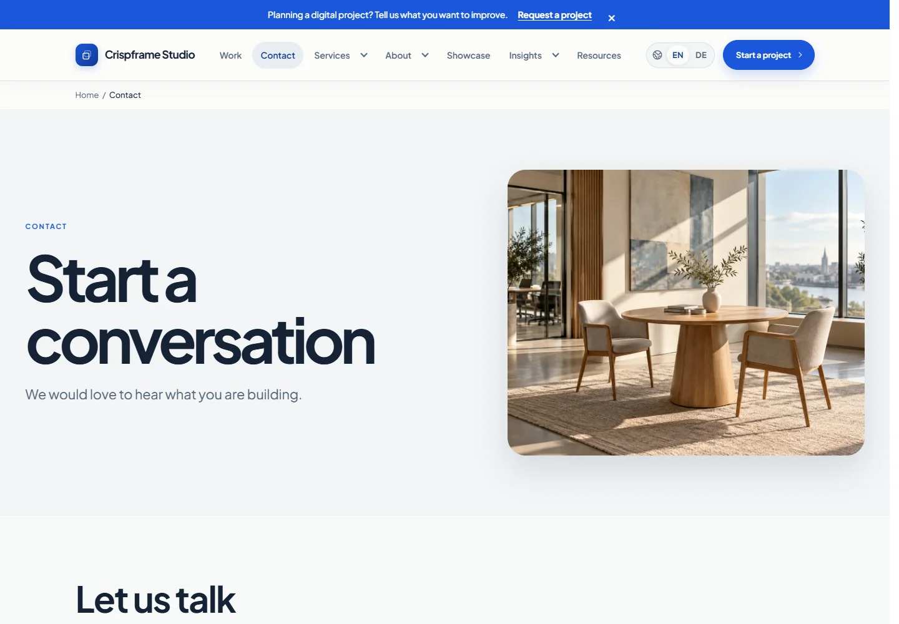

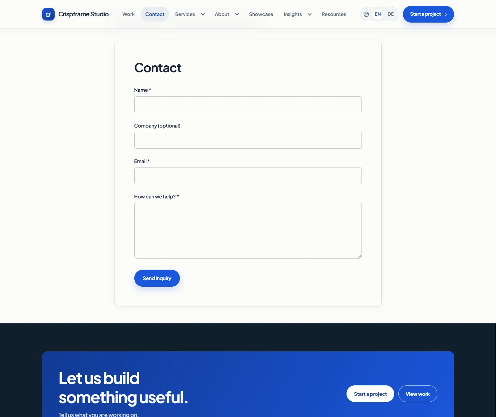

## Work and case studies

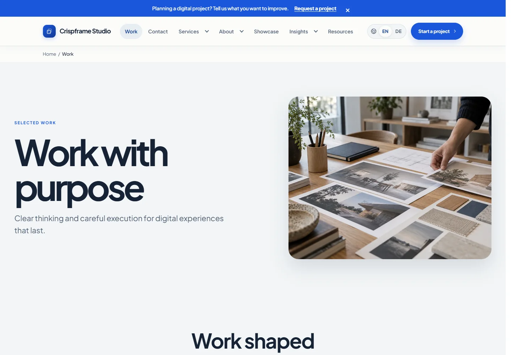

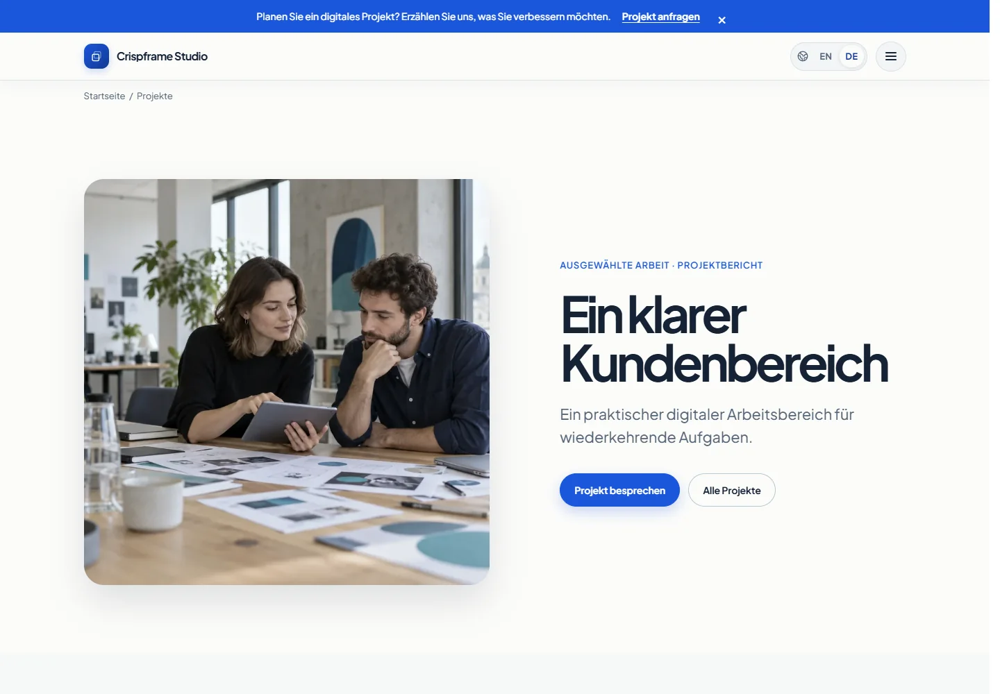

## Editorial pages

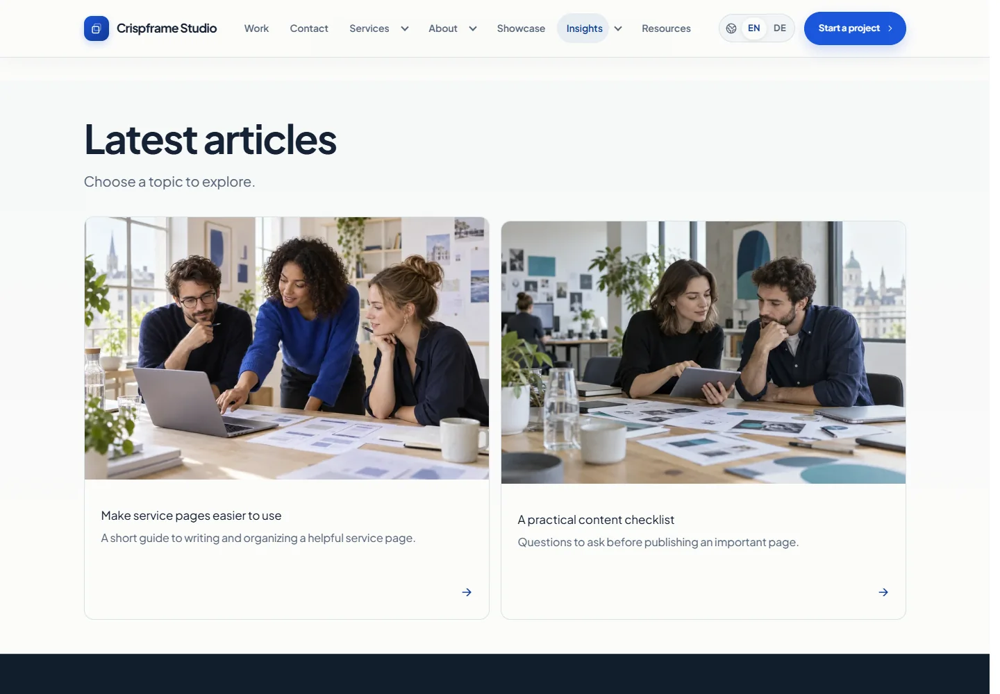

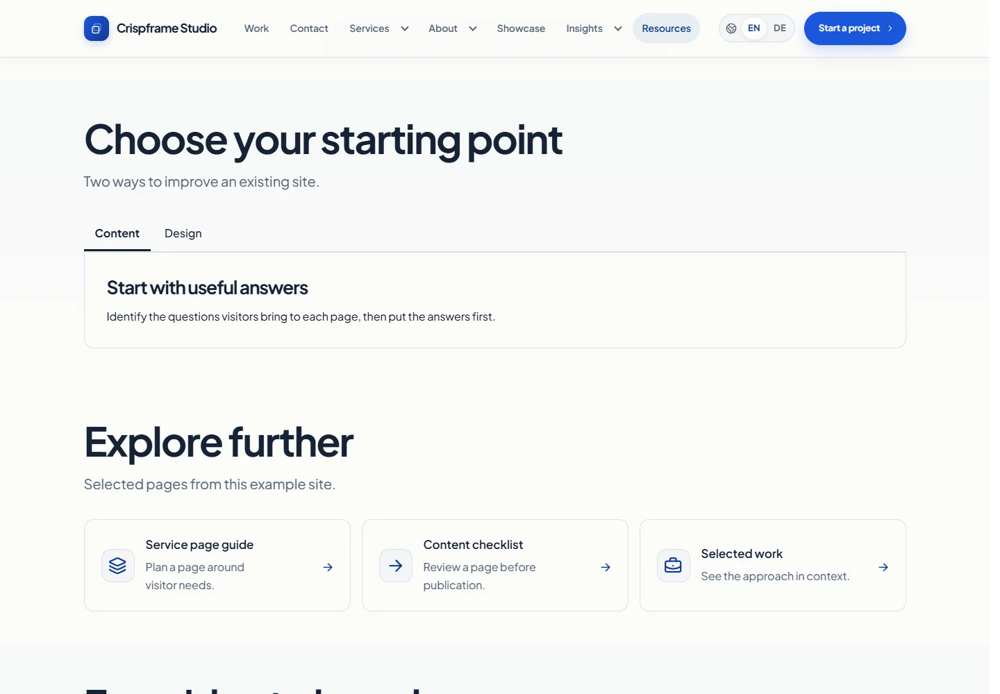

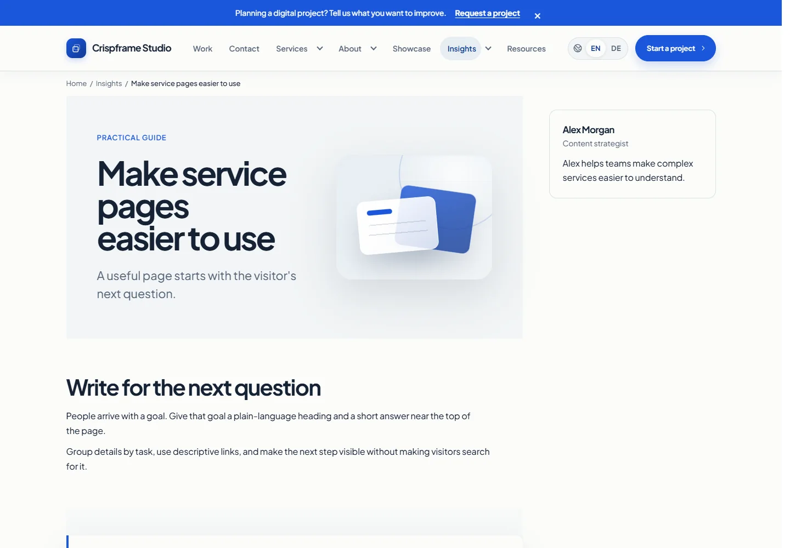

## Services and company pages

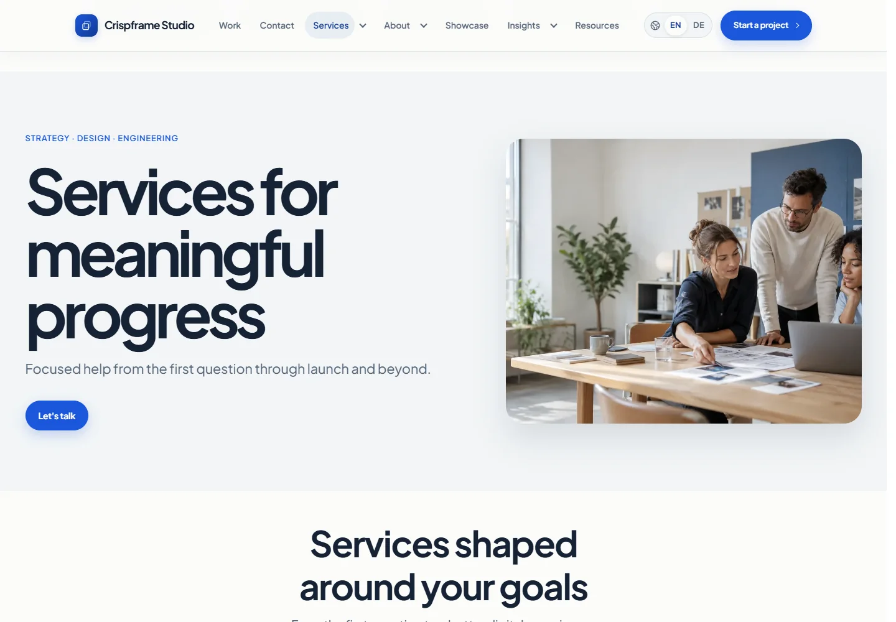

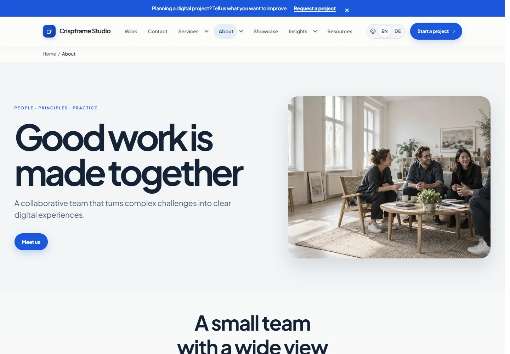

## Updating these images

Use the [screenshot capture workflow](https://github.com/PhantomPixelDev/crispframe/blob/main/DEVELOPMENT.md#refresh-the-readme-screenshots). Images are compressed to WebP for repository previews. The underlying demo photos remain in the optional demo package.
